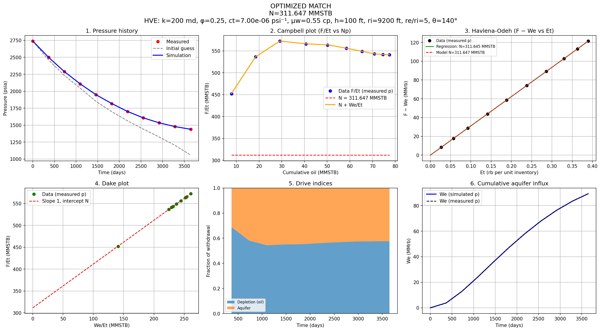
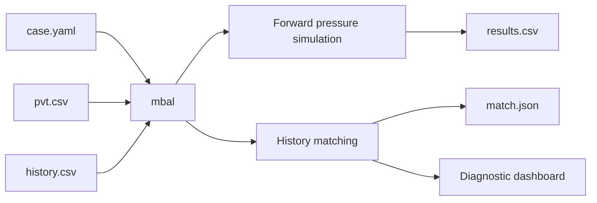
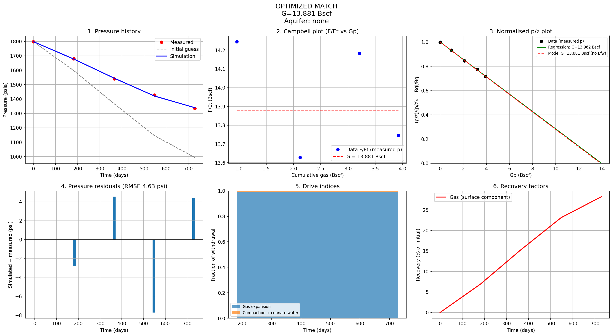
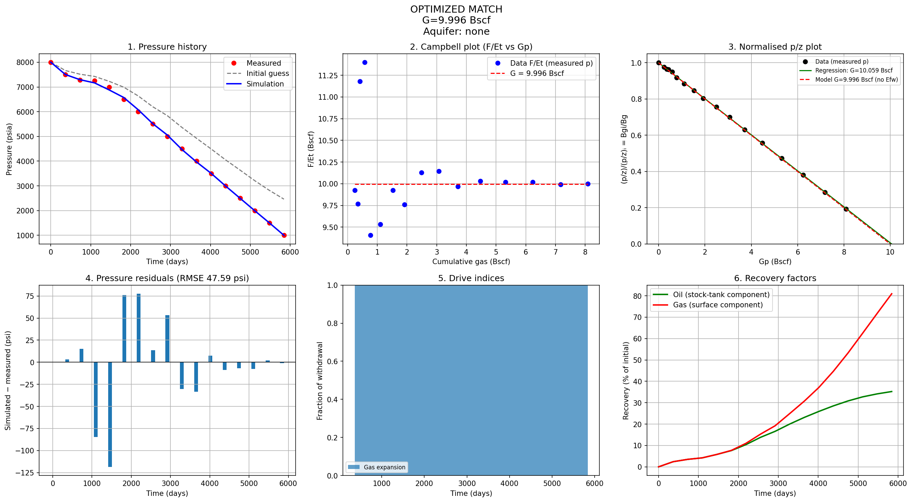

# mbal

**Material balance, aquifer modelling and pressure-history matching in Python.**

`mbal` is a compact reservoir-engineering tool for running tank material-balance models from simple YAML + CSV inputs. It supports oil, gas, volatile-oil and gas-condensate systems, with optional water influx and automated pressure-history matching.

  

## What it does

- Runs forward material-balance pressure calculations.
- Matches selected reservoir and aquifer parameters to measured pressure.
- Supports **no aquifer**, **Fetkovich**, **Carter–Tracy (CT)** and **van Everdingen–Hurst (HVE)**.
- Handles **dry gas**, **black oil**, **oil + gas cap**, **volatile oil**, **wet gas** and **gas condensate**.
- Produces a **dashboard**.
- Uses literature examples from **Ahmed, Dake, Walsh and Walsh & Lake** for validation.

  
  

## Bundled examples

| Example | Main purpose |
|---|---|
| `dry_gas` | Dry-gas |
| `oil_gas_cap` | Black oil with an initial gas cap |
| `oil_water_drive_hve` |  Black oil with HVE aquifer |
| `oil_water_drive_fetkovich` | Black oil with Fetkovich aquifer |
| `volatile_oil` | Volatile-oil |
| `gas_condensate_rich` | Rich gas-condensate |
| `gas_condensate_lean` | Lean gas-condensate |
| `wet_gas` | Wet-gas |

See **[examples/README.md](examples/README.md)** for figures, source references and validation targets.

## References

Ahmed, T. (2010). Reservoir Engineering Handbook (4th ed.). Gulf Professional Publishing.
Dake, L. P. (1978). Fundamentals of Reservoir Engineering. Elsevier.
Walsh, M. P. (1995). A generalized approach to reservoir material balance calculations. Journal of Canadian Petroleum Technology, 34(1), 55–63. https://doi.org/10.2118/95-01-05
Walsh, M. P., Ansah, J., & Raghavan, R. (1994). The new, generalized material balance as an equation of a straight line: Part 1 – Applications to undersaturated, volumetric reservoirs (SPE Paper 27684). Society of Petroleum Engineers. https://doi.org/10.2118/27684-MS
Walsh, M. P., & Lake, L. W. (2003). A generalized approach to primary hydrocarbon recovery. Elsevier.

## License

See `LICENSE`.
